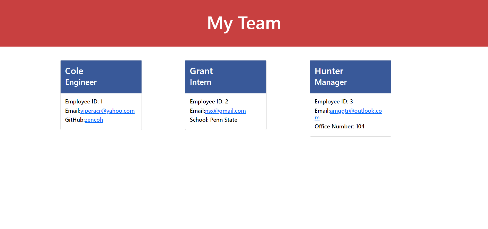

# Team Profile Generator

## Table of Contents
* [Description](#description)
* [Installation](#installation)
* [Usage](#usage)
* [Contributing](#contributing)
* [Tests](#tests)
* [Questions](#questions)

## Description
This project creates an html document that includes boxes with information about certain roles of employees. By using inquirer the user is prompted with questions about their team members, that information is then displayed on the webpage. I built this project to help myself understand a lot more about testing  and test files. I created 10 tests for this application that test the functionality and make sure that the data I colleted from the prompts are used properly. I learned a lot about test scripts and using the debug console to step by step work through my lines of code where there could be problems.

## Installation
After answering the prompt questions an html file will be created. If you want to use that in a different application then you simply need to move it into your current project by using the terminal or file explorer.

## Usage
In the terminal 'cd' into the CreateTeamProfiles directory then to start the application type 'node index.js'.

Please watch a short walkthrough video [here](https://drive.google.com/file/d/1d3MpGaSLqqnkLVVtcEbCcQqtwPU9XP3_/view).

## Contributing
Thank you for investing your time in reading through my code and README. Since I am creating this application for a coding bootcamp I am not taking contributions at this time.

## Tests
To test this application in the terminal move into the CreateTeamProfiles directory then type 'npm run test'. This is also touched on in the walkthrough video [here](https://drive.google.com/file/d/1d3MpGaSLqqnkLVVtcEbCcQqtwPU9XP3_/view).

## Questions
For any questions, please feel free to reach out to me on GitHub at [zencoh](https://github.com/zencoh). You can also reach me at chsoccer4@outlook.com.
